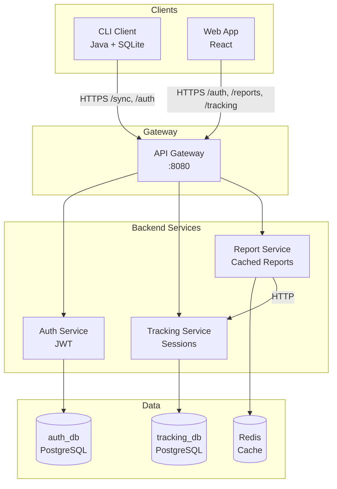
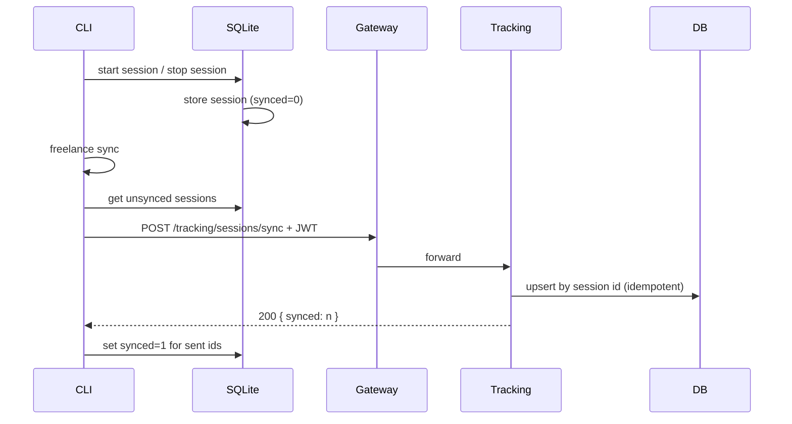
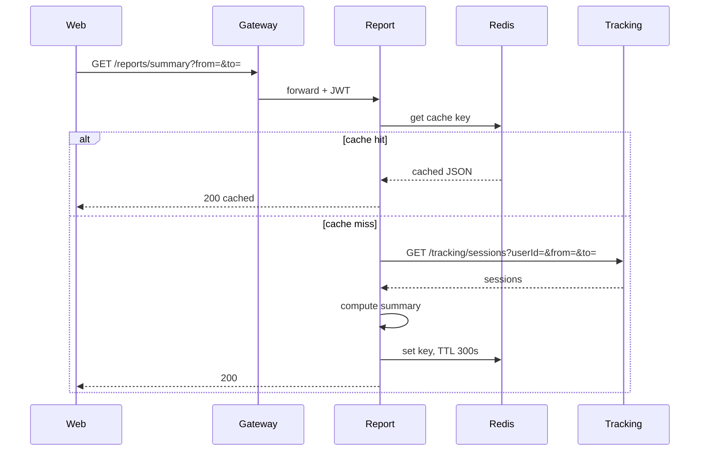

# Architecture Diagram (Mermaid)

## System Context



## Sync Flow (Offline-First)



## Report Caching



## Database per Service

```mermaid
erDiagram
    AUTH_DB ||--o{ users : ""
    users {
        uuid id PK
        varchar email UK
        varchar password_hash
        timestamp created_at
    }

    TRACKING_DB ||--o{ sessions : ""
    sessions {
        uuid id PK
        uuid user_id
        varchar project_id
        timestamp start_time
        timestamp end_time
        int duration_minutes
        varchar device_id
        timestamp created_at
    }

    ReportService ..> Redis : "cache"
    ReportService ..> TrackingService : "HTTP"
```
